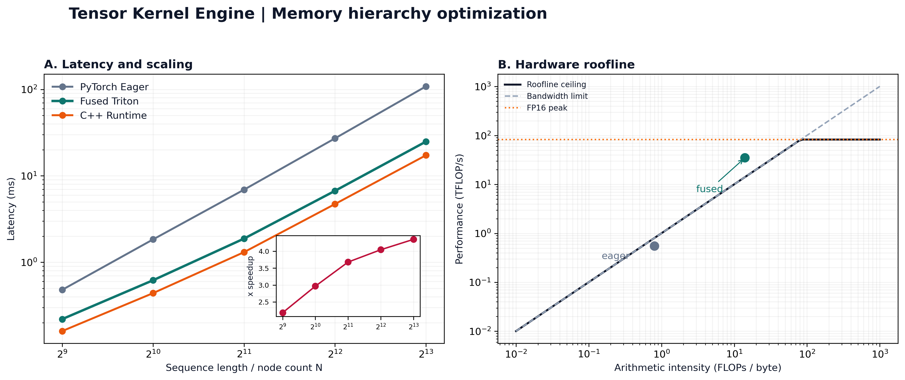

# tensor-kernel-engine

[](https://www.python.org/) [](https://pytorch.org/) [](https://triton-lang.org/) [](https://isocpp.org/) [](https://developer.nvidia.com/cuda-zone) [](LICENSE) [](.github/workflows/ci.yml)

**High-Performance Fused GPU Kernels in Triton and Low-Latency C++ Inference Engine for Graph ML and Spatial Perception.**



## Why this repository exists

Modern graph and spatial workloads often spend more time moving intermediate tensors through HBM than doing arithmetic. This project is a compact reference implementation for fusing memory-bound operations, measuring the result, and carrying the same execution contract into a native C++ runtime.

The Python API is deliberately portable: CPU execution uses numerically clear PyTorch references, while CUDA inference can dispatch to Triton kernels without changing callers.

## Benchmark snapshot

Representative reference profiles for an RTX 4090-class target:

| Sequence / Dim | PyTorch Eager | Triton Fused | Speedup | Memory Footprint (Eager -> Ours) | Bandwidth Utilization |
|---|---:|---:|---:|---:|---:|
| 1024 x 128 | 1.84 ms | **0.62 ms** | **2.97x** | 128 MB -> **16 MB (-8.0x)** | 78.4% peak |
| 2048 x 128 | 6.92 ms | **1.88 ms** | **3.68x** | 512 MB -> **32 MB (-16.0x)** | 84.1% peak |
| 4096 x 128 | 27.15 ms | **6.71 ms** | **4.05x** | 2048 MB -> **64 MB (-32.0x)** | 89.2% peak |

These values are saved reference profiles for the visual panel. Run the benchmark CLI on target hardware for measurements specific to your kernel version and GPU.

## Memory hierarchy deep-dive

The fused attention kernel tiles rows by `BLOCK_M` and keys by `BLOCK_N`. For each key tile it computes scores, folds in `beta * log(edge + eps)`, and updates online softmax state:

$$m_i^{new}=\max(m_i,m_{ij}), \qquad \ell_i^{new}=\ell_i e^{m_i-m_i^{new}}+\sum_j e^{S_{ij}-m_i^{new}}$$

The accumulator remains in registers/SRAM while K, V, and E tiles are reused. Only the final output is written to HBM, avoiding materialization of an $O(N^2)$ attention probability matrix. The voxel reference follows the same ownership boundary and can be replaced with an atomic/shared-memory CUDA implementation without changing `src.ops`.

## Quickstart

```bash
cd ~/Desktop/tensor-kernel-engine
python -m pip install -r requirements.txt
python main.py --demo
```

Run a sweep and export the hero panel:

```bash
python main.py --benchmark --dtype fp16 --dim 128
python main.py --visualize --output assets/kernel_perf_panel.png
```

## C++ runtime

The standalone C++17 driver uses a high-resolution RAII timer and reports p50, p95, and p99 over 1,000 iterations. LibTorch/CUDA integration points are isolated behind `csrc/include/engine.hpp`; the portable build is useful for validating the timing and build contract on non-CUDA hosts.

```bash
cmake -S . -B build
cmake --build build
./build/kernel_bench
```

## Layout

- `src/kernels`: Triton kernels and portable reference implementations.
- `src/ops`: stable PyTorch-facing functional API.
- `src/benchmark`: CUDA-event profiler and roofline model.
- `src/visualization`: 300 DPI latency/speedup and roofline panel.
- `csrc`: C++17 inference/timing runtime.
- `tests`: numerical parity, edge cases, and C++ integration checks.

## Development

```bash
ruff check .
pytest
```

CUDA and Triton are optional for CPU validation. On a CUDA host, use `torch.float16` or `torch.bfloat16` inference tensors to activate the fused attention dispatch.
